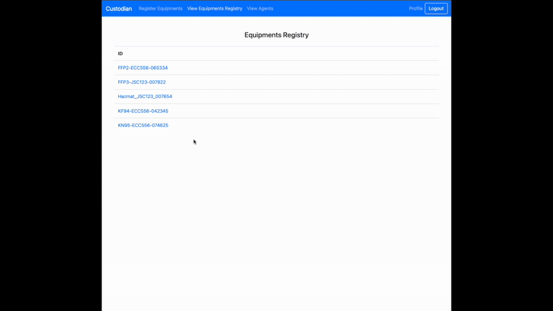
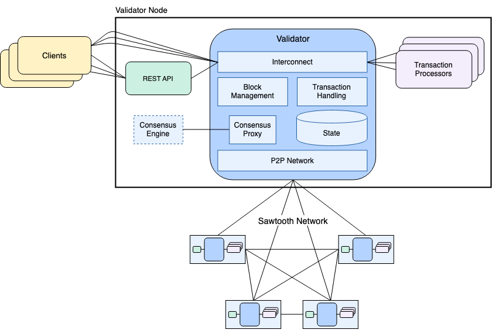

# Chain4India

* **List of HAC funded projects**: [view](https://docs.google.com/spreadsheets/d/e/2PACX-1vTey3YTuoUi49Eijyf3Yl-FoyhCkaVwslK9zQRcgCQqOZu1XrjLiqEy-5qUQ17vNOTzuWzM7K0Qsd9v/pubhtml)

```
Project Name: Blockchain Using Hyperledger Sawtooth to Combat COVID-19
Project Number: 20-COV-047
Funding Organization:
  IEEE Humanitarian Activities Committee (HAC) &
  IEEE Special Interest Group on Humanitarian Technology (SIGHT)
```

|  |  |  |
| ----------------------------- | ------------------------------------------------------------------ | ------------------------ |

A blockchain solution for traceability, trust, and transparency in the medical equipment supply chain.

## Demo GIFs




## Problem Statement

The healthcare industry faces a significant issue with substandard medical equipment being sold at low prices, compromising safety and quality. Products like masks, PPE kits, and other critical medical devices are often produced with inferior materials or insufficient standards, putting patients and medical staff at risk.

Key challenges:

* **Traceability**: Difficulty in tracking the source and distribution path of equipment.
* **Trust**: Ensuring that medical equipment meets safety standards and is certified for use.
* **Transparency**: Difficulty in verifying appropriate pricing.

## Proposed Solution

Chain4India is a blockchain-based solution built on **Hyperledger Sawtooth** that ensures:

* **Traceability**: Detailed tracking from manufacturing to distribution.
* **Trust**: Transparent, secure, and verifiable records to assure quality and certification.
* **Transparency**: Immutable pricing and transaction records.

## Key Features

* **Smart Contracts**: Automate compliance and verification processes.
* **Immutable Records**: Tamper-proof audit trails.
* **Decentralized Network**: Reduces fraud risk and single points of failure.

## Usage

### Prerequisites

* `git`
* `docker`
* `docker-compose`

### Clone Repository

```bash
git clone <repository-url>
cd Chain4India
```

### Start Application

```bash
docker-compose up
```

This command starts all Chain4India components in separate Docker containers.

### Available Endpoints

| Component          | URL                                            |
| ------------------ | ---------------------------------------------- |
| Custodian Client   | [http://localhost:8040](http://localhost:8040) |
| Backend REST API   | [http://localhost:8000](http://localhost:8000) |
| PostgreSQL Adminer | [http://localhost:8080](http://localhost:8080) |
| Sawtooth REST API  | [http://localhost:8008](http://localhost:8008) |


## Architecture Diagram



## License

MIT
